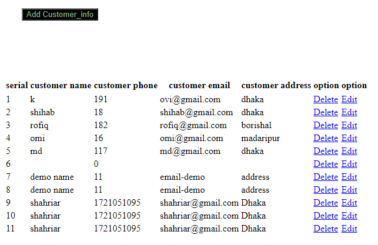

# Welcome to Inventorty Management System

1.For full documentation visit [ims.com.bd](http://localhost/inventory/).

2.For feature documentation visit [ims.com.bd](http://localhost/ovi/).

## CSE-322

*Software Enginerring Lab Project* 

*

### Languages
1. Server
    1. php
    1. mysql
1. **html**
1. **css**
1. **jQuery**

### Apis
1. fetch

### Tools
1. GitHub

### Sample Code

Some of the jQuery ....

   
            $query = "SELECT * FROM customer_info order by customer_id asc";
            if ($result = $conn->query($query))
            $query = "SELECT * FROM customer_info where  customer_id='$id'";
            $sql = "Insert into customer_info VALUES(NULL,'$Name', '$Phone','$Email','$Address')";
            $sql = "DELETE FROM customer_info where customer_id='$id'";
            $sql = "Update customer_info SET customer_name='$Name',  customer_phone='$Phone', customer_email ='$Email',customer_address='$Address'WHERE customer_id='$Id' ";

### Feature Image

