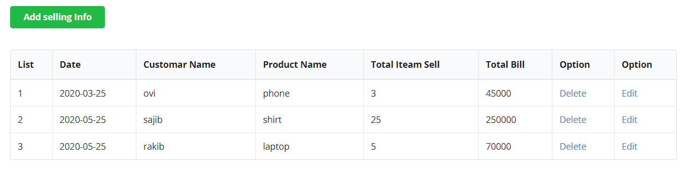

# Welcome to Inventorty Management System

1.For full documentation visit [ims.com.bd](http://localhost/inventory/).

2.For feature documentation visit [ims.com.bd](http://localhost/p2/home.php).

## CSE-322

**Software Enginerring Lab Project** 

***

### Languages
1. Server
    1. php
    1. mysql
1. ***html***
1. ***css***
1. ***jQuery***

### Apis
1. fetch

### Tools
1. GitHub

### Sample Code

> Some of the jQuery ....

    SELECT * FROM selling_info order by date asc ;
    Update selling_info SET date='$Date', customar_name='$CName', product_name='$Name',  total_iteam='$iteam',total_bill='$bill' WHERE selling_id='$Id'";
    DELETE  FROM selling_info where  selling_id='$id'";
    Insert into selling_info VALUES(NULL,'$Date','$CName', '$Name', '$iteam','$bill')";

### Feature Image

