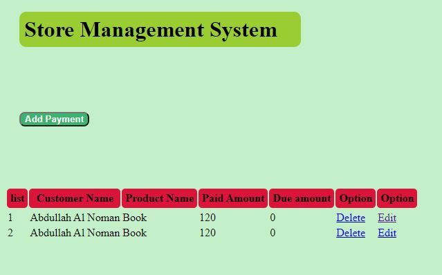

# STORE MNAGEMENT SYSTEM

## Payment Information

* Admin can add payment information
* Admin can view the payment information
* Admin can edit the payment information 
* Admin can also  delete the payment information

### Tools
1. GitHub

### Languages
1. HTML
1. CSS
1. Server
    1. php
    1. mysql

### Black Box text by `Python`

*** Some portion of code of blackbox testing ***

   from selenium import webdriver
    from webdriver_manager.chrome import ChromeDriverManager
    from selenium.webdriver.common.keys import Keys
    import time
    driver = webdriver.Chrome(ChromeDriverManager().install())
    driver.get("http://localhost/project/addfrom_payment.html")
    inputcustomarname = driver.find_element_by_xpath('/html/body/div[2]/form/div[2]/input')
    inputcustomarname.send_keys('Nouman')
    time.sleep(2)
    inputProductName = driver.find_element_by_xpath('/html/body/div[2]/form/div[3]/input')
    inputProductName.send_keys('Book')
    time.sleep(2)
    inputPaidAmount = driver.find_element_by_xpath('/html/body/div[2]/form/div[4]/input')
    inputPaidAmount.send_keys('10')
    time.sleep(2)
    inputDueAmount = driver.find_element_by_xpath('/html/body/div[2]/form/div[5]/input')
    inputDueAmount.send_keys('100')
    time.sleep(2)
    btnSubmit = driver.find_element_by_xpath('/html/body/div[2]/form/div[6]/button')
    btnSubmit.click()
    time.sleep(3)
 

#### Payment information feature

