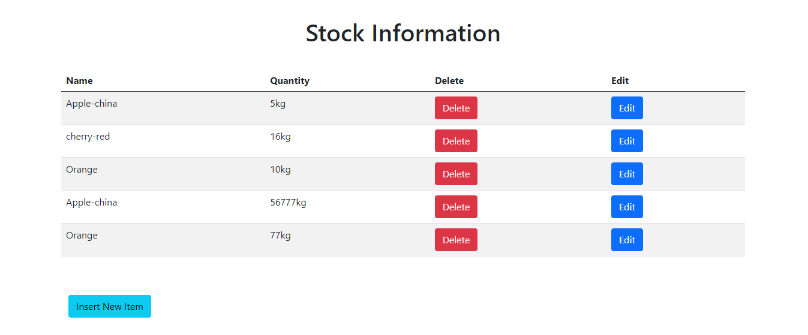

# STORE MNAGEMENT SYSTEM

## Short descrition of Stock Information in our website

* Basically, It is dashboard where admin or aouthority can see the available stock
* Admin can insert new stocks
* Admin can update about a stocks information
* And Admin also can delete all stocks

### Languages
1. HTML
1. CSS
1. CSS framework
    1. Bootstrap
1. Server
    1. php
    1. mysql

### Apis
1. fetch

### Tools
1. GitHub

### Black Box text by `Python`

*** Some portion of code ***

    from selenium import webdriver
    from webdriver_manager.chrome import ChromeDriverManager
    driver = webdriver.Chrome(ChromeDriverManager().install())
    driver.get("http://127.0.0.1/sms/stock-info.php")
    print(driver.title)
    btn = driver.find_element_by_id('insert')
    # print(btn.text)
    btn.click()
    textField1 =driver.find_element_by_name('pname')
    textField1.send_keys('Grape')
    textField2 =driver.find_element_by_name('quantity')
    textField2.send_keys('10')
    insrtBtn = driver.find_element_by_xpath('/html/body/form/input[3]')
    insrtBtn.click()
 

### Sample stock Dashboard

