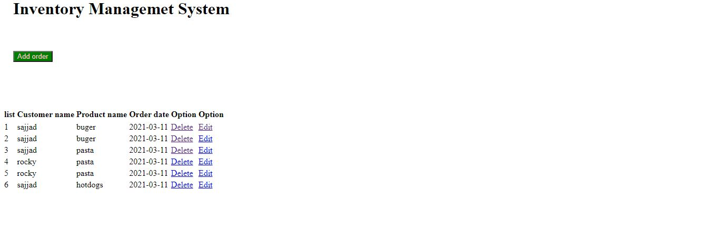

# Welcome to Inventorty Management System

1.For full documentation visit [ims.com.bd](http://localhost/inventory/).

2.For feature documentation visit [ims.com.bd](http://localhost/soft/).

## CSE-322

*Software Enginerring Lab Project* 

*

### Languages
1. Server
    1. php
    1. mysql
1. **html**
1. **css**
1. **jQuery**

### Apis
1. fetch

### Tools
1. GitHub

### Sample Code

Some of the jQuery ....

   $query = "SELECT * FROM order_list order by order_id asc";
            if ($result = $conn->query($query))
    $query = "SELECT * FROM order_list where  order_id='$id'";
    $sql = "Insert into order_list VALUES(NULL,'$CName', '$PName','$Date')";
   $sql = "Update order_list SET Customer_name='$CName',Product_name='$PName',Order_date='$Date' WHERE order_id='$Id'";

### Feature Image

